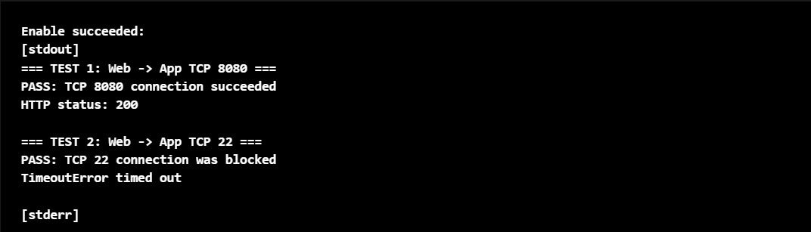
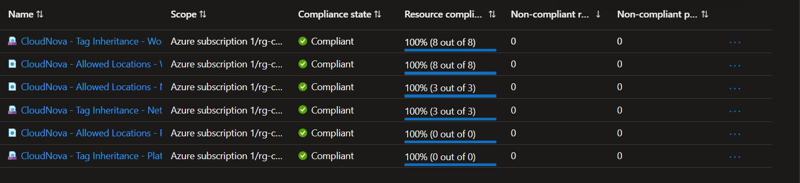

# Secure Azure Landing Zone — CloudNova

A governed, segmented, and security-focused Microsoft Azure landing zone designed for a simulated growing software company.

This project demonstrates how Azure governance, identity, RBAC, policy, network segmentation, resource protection, cost awareness, and auditability can be combined to establish a secure foundation for future cloud workloads.

---

## Project Overview

CloudNova Technologies is a fictional software company expanding its use of Microsoft Azure.

As different teams began deploying resources independently, the environment developed several governance and security risks:

- Inconsistent resource organization.
- Broad administrative permissions.
- Missing ownership and cost metadata.
- Inconsistent deployment locations.
- Limited separation between networking and application responsibilities.
- Weak protection against accidental deletion.
- Unstructured network deployment.
- Limited governance visibility.

The objective of this project was to design and implement a **secure Azure landing-zone foundation** before additional workloads are introduced.

Rather than reproducing a full enterprise-scale Azure Landing Zone, the architecture was intentionally adapted to a single Azure Pay-As-You-Go subscription while preserving core enterprise governance principles.

---

## Business Objectives

The CloudNova landing zone was designed to provide:

- Consistent Azure resource organization.
- Least-privilege access.
- Separation of administrative responsibilities.
- Policy-based governance.
- Standardized resource metadata.
- Approved-region enforcement.
- Network segmentation.
- Restricted workload communication.
- Protection of foundational resources.
- Cost-accountability foundations.
- Management-plane auditability.
- A scalable foundation for future workloads.

---

## Architecture

```text
Microsoft Entra ID
        │
        ├── CloudNova-Platform-Admins
        ├── CloudNova-Network-Admins
        ├── CloudNova-App-Team
        └── CloudNova-Auditors
        │
        ▼
Scoped Azure RBAC
        │
        ▼
Azure Pay-As-You-Go Subscription
        │
        ├─────────────────────────────────────────┐
        │                                         │
        │        CloudNova Landing Zone           │
        │                                         │
        │  rg-cloudnova-platform-lab              │
        │                                         │
        │  rg-cloudnova-network-lab               │
        │          │                              │
        │          ├── Virtual Network            │
        │          ├── Web Subnet                 │
        │          ├── Application Subnet         │
        │          ├── Network Security Groups    │
        │          └── CanNotDelete Lock          │
        │                                         │
        │  rg-cloudnova-workload-lab              │
        │          │                              │
        │          ├── Web Validation VM          │
        │          └── App Validation VM          │
        │                                         │
        └─────────────────────────────────────────┘
                          │
                          ▼
                Governance Guardrails
                          │
                ├── Allowed Locations
                ├── Tag Inheritance
                ├── Naming Standards
                ├── Resource Protection
                └── Cost Attribution
                          │
                          ▼
               Monitoring & Auditability
                          │
                ├── Azure Policy Compliance
                └── Azure Activity Log
```

---

## Resource Organization

CloudNova uses three resource groups to separate operational responsibilities.

### Platform

```text
rg-cloudnova-platform-lab
```

Used for shared and platform-level CloudNova resources.

### Network

```text
rg-cloudnova-network-lab
```

Contains the shared networking foundation.

### Workload

```text
rg-cloudnova-workload-lab
```

Contains application and validation workloads.

This separation allows Azure RBAC and resource protection to be applied according to responsibility rather than granting broad access across the entire environment.

---

## Identity and RBAC Model

Microsoft Entra security groups were created to represent different operational responsibilities.

| Group | Azure Role | Scope |
|---|---|---|
| `CloudNova-Platform-Admins` | Contributor | CloudNova project resource groups |
| `CloudNova-Network-Admins` | Network Contributor | Network resource group |
| `CloudNova-App-Team` | Contributor | Workload resource group |
| `CloudNova-Auditors` | Reader | CloudNova project resource groups |

The CloudNova test identities were assigned to these groups rather than receiving Azure permissions directly.

This demonstrates group-based access administration and scoped delegation.

---

## Delegated Administration

The access model intentionally separates responsibilities.

```text
Platform Administrators
        ↓
CloudNova platform administration

Network Administrators
        ↓
Network resources only

Application Team
        ↓
Workload resources only

Auditors
        ↓
Read-only visibility
```

No CloudNova test group was granted subscription-level Owner access.

The subscription Owner account remains responsible for tasks such as Azure Policy administration, RBAC administration, and environment bootstrap.

---

## Azure Policy Governance

Two primary governance controls were implemented.

### Allowed Locations

The built-in Azure Policy:

```text
Allowed locations
```

was assigned to each CloudNova resource-group scope.

The approved region is:

```text
South Africa North
```

This prevents CloudNova resources from being deployed into unapproved Azure regions.

---

### Governance Tag Inheritance

A custom policy initiative was created:

```text
CloudNova - Governance Tag Inheritance
```

The initiative uses the built-in:

```text
Inherit a tag from the resource group if missing
```

policy for:

```text
Environment
Owner
Workload
CostCenter
```

This allows CloudNova resources to automatically inherit governance metadata from their parent resource group when those tags are missing.

---

## Governance Tags

CloudNova uses the following core metadata:

| Tag | Purpose |
|---|---|
| `Environment` | Identifies deployment environment |
| `Owner` | Identifies the responsible team |
| `Workload` | Identifies the workload or platform purpose |
| `CostCenter` | Supports cost accountability |

Example network resource-group metadata:

```text
Environment = Lab
Owner = CloudNova-Network
Workload = NetworkFoundation
CostCenter = CloudNova-IT
```

---

## Network Architecture

The landing zone uses one segmented Virtual Network.

### Virtual Network

```text
vnet-cloudnova-lab-san-01
```

Address space:

```text
10.20.0.0/16
```

### Web Subnet

```text
snet-cloudnova-web-lab-01
10.20.10.0/24
```

### Application Subnet

```text
snet-cloudnova-app-lab-01
10.20.20.0/24
```

### Reserved Future Address Space

```text
10.20.30.0/24
```

The reserved range was documented but not deployed because no current workload requires it.

---

## Network Security

Two subnet-level Network Security Groups were used:

```text
nsg-cloudnova-web-lab-01
nsg-cloudnova-app-lab-01
```

The application subnet implements the primary segmentation boundary.

### Allowed Traffic

```text
Source:
10.20.10.0/24

Destination:
10.20.20.0/24

Protocol:
TCP

Port:
8080

Action:
Allow
```

### Denied Traffic

Other traffic originating from the web subnet toward the application subnet is explicitly denied.

The resulting model is:

```text
Web subnet
10.20.10.0/24
        │
        ├── TCP 8080
        │      ↓
        │    ALLOW
        │
        └── Other traffic
               ↓
             DENY
        │
        ▼
Application subnet
10.20.20.0/24
```

---

## Private Workload Validation

Two temporary Linux virtual machines were used to validate the network architecture.

```text
Web VM
10.20.10.4
```

and:

```text
Application VM
10.20.20.4
```

Neither VM was given a public IP address.

Administrative testing was performed through Azure management capabilities instead of exposing SSH directly to the Internet.

---

## Network Security Validation

The application VM was configured with a temporary service listening on:

```text
TCP 8080
```

SSH on TCP 22 was also confirmed to be listening so that blocked traffic could be distinguished from an unavailable service.

Testing from the Web VM produced:

```text
=== TEST 1: Web -> App TCP 8080 ===
PASS: TCP 8080 connection succeeded
HTTP status: 200

=== TEST 2: Web -> App TCP 22 ===
PASS: TCP 22 connection was blocked
TimeoutError timed out
```

This demonstrated that the NSG configuration allowed required application communication while blocking unauthorized cross-subnet traffic.

---

## RBAC Validation

The implemented RBAC boundaries were validated using separate Microsoft Entra test identities.

### Application Team

The `CloudNova Application User` could access:

```text
rg-cloudnova-workload-lab
```

but could not see the CloudNova network or platform resource groups.

**Result: PASS**

---

### Network Administrator

The `CloudNova Network Administrator` could access:

```text
rg-cloudnova-network-lab
```

but could not see the workload or platform resource groups.

**Result: PASS**

---

### Auditor

The `CloudNova Auditor` had Reader access across CloudNova resources.

The Auditor attempted to:

- Delete the platform resource group.
- Add an NSG inbound rule.
- Delete a virtual machine.
- Stop a virtual machine.

All modification operations were denied.

**Result: PASS**

This demonstrated read-only visibility without management capability.

---

## Resource Protection

The shared network foundation is protected using a resource-group-level management lock.

### Scope

```text
rg-cloudnova-network-lab
```

### Lock

```text
CloudNova-Network-Delete-Protection
```

### Type

```text
CanNotDelete
```

The lock is inherited by resources inside the network resource group.

Deletion attempts against both a Network Security Group and the Virtual Network were blocked successfully.

**Result: PASS**

---

## Azure Policy Validation

### Tag Inheritance

A Network Security Group was intentionally created without manually entering any tags.

Azure Policy automatically applied:

```text
Environment = Lab
Owner = CloudNova-Network
Workload = NetworkFoundation
CostCenter = CloudNova-IT
```

**Result: PASS**

---

### Unapproved Region

A test deployment was attempted in:

```text
East US
```

Azure Policy displayed:

```text
Deny (Policy details)
```

and prevented the deployment.

**Result: PASS**

---

### Approved Region

Resources deployed in:

```text
South Africa North
```

were created successfully.

**Result: PASS**

---

## Policy Compliance

Azure Policy compliance was reviewed after deployment.

At the time of validation:

### Workload Scope

```text
Tag Inheritance
100% compliant — 8 out of 8 resources

Allowed Locations
100% compliant — 8 out of 8 resources
```

### Network Scope

```text
Tag Inheritance
100% compliant — 3 out of 3 resources

Allowed Locations
100% compliant — 3 out of 3 resources
```

The platform assignments were also present and compliant, although no child platform resources existed at the time of validation.

---

## Auditability

Azure Activity Log was used to validate management-plane accountability.

One validated event recorded creation of:

```text
CloudNova-Network-Delete-Protection
```

The event contained:

- Operation name.
- Resource.
- Initiating identity.
- Timestamp.

This demonstrated that important CloudNova management operations could be attributed to the administrator who performed them.

---

## Key Security Controls

The project demonstrates:

- Microsoft Entra security groups.
- Group-based Azure RBAC.
- Least privilege.
- Delegated administration.
- Separation of duties.
- Resource-group-based governance.
- Azure Policy.
- Policy initiatives.
- `Modify` policy behavior.
- Governance tag inheritance.
- Region restrictions.
- Virtual Network segmentation.
- Network Security Groups.
- Explicit allowed and denied network paths.
- Private VM deployment.
- Management locks.
- Azure Policy compliance.
- Azure Activity Log.
- Cost-conscious cloud architecture.

---

## Security and Governance Test Results

| Validation | Result |
|---|---|
| Governance tag inheritance | **PASS** |
| Unapproved region blocked | **PASS** |
| Approved-region deployment | **PASS** |
| Web/App subnet segmentation | **PASS** |
| Web → App TCP 8080 | **ALLOWED — PASS** |
| Web → App TCP 22 | **DENIED — PASS** |
| Application-team scope | **PASS** |
| Network-administrator scope | **PASS** |
| Auditor read-only access | **PASS** |
| Network resource deletion protection | **PASS** |
| Azure Policy compliance visibility | **PASS** |
| Azure Activity Log auditability | **PASS** |

---

## Evidence

Selected evidence is stored in the [`screenshots/`](screenshots/) directory.

### Network Segmentation Validation



The test demonstrates:

```text
TCP 8080 → Allowed
TCP 22   → Blocked
```

### Azure Policy Compliance



The compliance view demonstrates successful evaluation of CloudNova's Allowed Locations and Governance Tag Inheritance controls.

Additional evidence may include:

- Allowed-location policy denial.
- RBAC scope validation.
- Resource-lock deletion denial.
- Azure Activity Log auditability.

---

## Project Documentation

Detailed documentation is available in the `docs/` directory:

- [Customer Discovery](docs/customer-discovery.md)
- [Governance Design](docs/governance-design.md)
- [Architecture Decision](docs/architecture-decision.md)
- [Network Design](docs/network-design.md)
- [Implementation](docs/implementation.md)
- [Security and Governance Testing](docs/testing.md)

---

## Repository Structure

```text
secure-azure-landing-zone/
│
├── README.md
├── .gitignore
│
├── docs/
│   ├── customer-discovery.md
│   ├── governance-design.md
│   ├── architecture-decision.md
│   ├── network-design.md
│   ├── implementation.md
│   └── testing.md
│
└── screenshots/
    ├── azure-policy-compliance.png
    ├── network-segmentation-validation.png
    └── additional validation evidence
```

---

## Key Architecture Decisions

### Single Subscription Instead of Enterprise-Scale Landing Zone

The project uses a governed single-subscription model rather than deploying management groups and multiple subscriptions.

This reflects the size and requirements of the simulated customer environment while still demonstrating core landing-zone governance principles.

---

### Resource-Group-Based Delegation

Platform, network, and workload responsibilities were separated using dedicated resource groups and scoped Azure RBAC.

This provides meaningful administrative boundaries without unnecessary subscription complexity.

---

### Azure Policy Instead of Manual Governance

Required metadata and region restrictions are controlled through Azure Policy rather than documentation alone.

This converts governance requirements into enforceable cloud controls.

---

### NSGs Instead of Azure Firewall

The current requirement is subnet-level traffic segmentation.

Network Security Groups provide the required control without introducing the cost and complexity of an enterprise firewall service that the current scenario does not require.

---

### Private Validation Workloads

Temporary Linux VMs were deployed without public IP addresses.

This allowed network-security testing without creating unnecessary direct Internet exposure.

---

### Resource-Group-Level Deletion Protection

The CloudNova network resource group uses a `CanNotDelete` lock.

Applying the lock at this scope protects the shared network foundation consistently rather than protecting only one individual network resource.

---

## Cost-Conscious Design

The project intentionally avoids unnecessary paid infrastructure.

Not deployed solely for demonstration:

- Azure Firewall.
- VPN Gateway.
- ExpressRoute.
- Microsoft Sentinel.
- Large always-on compute.
- Additional Azure subscriptions.
- Unnecessary public IP addresses.

Temporary validation VMs can be removed after evidence has been captured.

The architecture demonstrates that cost awareness is part of cloud design rather than an afterthought.

---

## Production Evolution

A larger CloudNova environment could evolve toward:

```text
Microsoft Entra ID
        ↓
Management Groups
        ↓
Multiple Azure Subscriptions
        │
        ├── Connectivity
        ├── Management / Security
        ├── Development
        └── Production
        ↓
Central Azure Policy
        ↓
Hub-and-Spoke Networking
        ↓
Workload Landing Zones
```

Potential future capabilities include:

- Management groups.
- Multi-subscription architecture.
- Hub-and-spoke networking.
- Azure Firewall.
- Private Endpoints.
- Private DNS.
- Centralized logging.
- Microsoft Sentinel.
- Privileged Identity Management.
- Conditional Access.
- Infrastructure as Code.
- Policy-as-code.
- Automated landing-zone deployment.
- Enterprise FinOps processes.

These are future architecture considerations and were not implemented as part of this project.

---

## Key Lessons

### Governance should exist before workloads scale

Trying to standardize a cloud environment after uncontrolled growth is more difficult than establishing guardrails early.

### Authentication and authorization are different concerns

Being able to sign in to Azure does not automatically mean an identity should have access to every resource.

### Scope matters

The same Azure role can have dramatically different risk depending on whether it is assigned at subscription, resource-group, or resource scope.

### Governance should be enforceable

Naming and tagging documents are useful, but Azure Policy turns important governance requirements into technical controls.

### Segmentation should be tested

Creating multiple subnets does not prove that network isolation works.

Actual traffic testing demonstrated that TCP 8080 was permitted while TCP 22 was blocked.

### Read-only access should be validated

The Auditor role was tested across several management operations rather than assumed to be read-only.

### Shared infrastructure deserves additional protection

Resource-group-level deletion protection reduced the risk of accidental removal of the network foundation.

### Auditability is part of architecture

Administrative activity should be attributable to identifiable identities.

---

## Skills Demonstrated

This project provided hands-on experience with:

- Azure landing-zone concepts.
- Cloud governance.
- Microsoft Entra ID.
- Security groups.
- Azure RBAC.
- Least privilege.
- Separation of duties.
- Azure Policy.
- Policy initiatives.
- Policy compliance.
- Azure tagging.
- Azure Virtual Networks.
- Subnet design.
- Network Security Groups.
- Network segmentation.
- Linux VM deployment.
- Private workload architecture.
- Network-security testing.
- Azure resource locks.
- Azure Activity Log.
- Cloud cost awareness.
- Troubleshooting.
- Security validation.
- Architecture decision-making.
- Technical documentation.

---

## Project Lifecycle

```text
Customer Discovery
        ↓
Governance Design
        ↓
Architecture Decision
        ↓
Network Design
        ↓
Azure Implementation
        ↓
Governance Validation
        ↓
RBAC Validation
        ↓
Network Security Testing
        ↓
Resource Protection Testing
        ↓
Policy Compliance Review
        ↓
Auditability Validation
        ↓
Documented Security Outcome
```

---

## Project Status

**Complete**

The defined Azure landing-zone governance, access-control, networking, resource-protection, and auditability requirements were implemented and successfully validated.

Temporary compute resources used for testing may be removed after portfolio evidence has been preserved.

---

## Disclaimer

This project was completed in a personal Azure learning environment using a fictional customer scenario.

It demonstrates hands-on architecture, implementation, governance, security testing, and troubleshooting experience.

It should not be interpreted as production enterprise landing-zone deployment experience.
